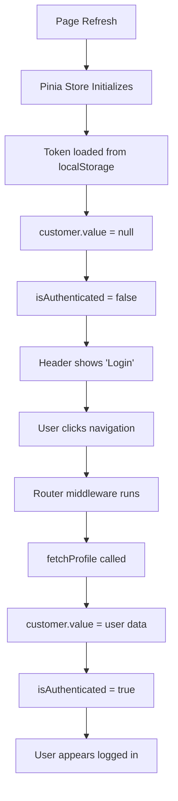

# Customer Authentication Refresh Issue - Root Cause Analysis

## Issue Description
When refreshing the browser on customer pages, the user appears logged out but gets logged back in when clicking to navigate to another page.

## Root Cause Identified ✅

### The Problem Flow



## Code Analysis

### 1. Store Initialization Issue

**File**: `resources/js/stores/customerAuth.js`

```javascript
// Line 16-20
const customer = ref(null);  // ❌ Always null on refresh
const token = ref(localStorage.getItem('customer_token')); // ✅ Loaded from storage
const isLoading = ref(false);

const isAuthenticated = computed(() => !!customer.value); // ❌ PROBLEM HERE
```

**The Critical Problem:**
- `token.value` is correctly loaded from `localStorage` on initialization
- But `customer.value` starts as `null` and is NEVER automatically populated
- `isAuthenticated` checks `customer.value`, not `token.value`
- Therefore, even with a valid token, user appears logged out

### 2. Middleware Behavior

**File**: `resources/js/router/middleware/customerAuth.js`

```javascript
// Lines 16-27
// Fetch customer profile if not loaded
if (!authStore.customer) {
  try {
    await authStore.fetchProfile();  // ✅ This fixes the state
  } catch (error) {
    // Token invalid, redirect to login
    return next({
      path: '/customer/login',
      query: { redirect: to.fullPath },
    });
  }
}
```

**Why Navigation "Fixes" It:**
- When user clicks to navigate, the middleware runs
- Middleware detects `customer` is null
- Calls `fetchProfile()` which loads customer data
- Now `isAuthenticated` becomes `true`

### 3. Header Display Logic

**File**: `resources/js/components/customer/CustomerHeader.vue`

```vue
<!-- Line 62 -->
<div v-if="authStore.isAuthenticated" class="relative">
```

**The Symptom:**
- On refresh: `isAuthenticated = false` → Shows "Login" button
- After navigation: `isAuthenticated = true` → Shows user menu

## Why This Happens

### Sequence on Page Refresh:
1. ✅ Vue app mounts
2. ✅ Pinia store initializes
3. ✅ Token loaded from localStorage
4. ❌ Customer data NOT loaded
5. ❌ `isAuthenticated` returns `false`
6. ❌ Header shows "Login" instead of user menu

### Sequence on Navigation:
1. User clicks navigation link
2. Router middleware runs
3. Middleware checks: `!authStore.customer` → `true`
4. Middleware calls `fetchProfile()`
5. API returns customer data
6. `customer.value` gets populated
7. `isAuthenticated` now returns `true`
8. Header updates to show user menu

## The Bug

**Inconsistent Authentication State:**
- Token exists ✅
- User is technically authenticated ✅
- But `customer.value` is null ❌
- So `isAuthenticated` returns false ❌

## Solutions

### Option 1: Fix `isAuthenticated` Computed (Quick Fix)

```javascript
// In customerAuth.js
const isAuthenticated = computed(() => !!token.value);
```

**Pros:**
- Simple one-line fix
- Immediately reflects token presence

**Cons:**
- User data still not loaded until navigation
- Header might show loading state briefly

### Option 2: Initialize Customer on App Load (Recommended)

**In `App.vue`:**
```javascript
import { onMounted } from 'vue';
import { useCustomerAuthStore } from './stores/customerAuth';

const authStore = useCustomerAuthStore();

onMounted(async () => {
  // If token exists, fetch profile on app load
  if (authStore.token && !authStore.customer) {
    try {
      await authStore.fetchProfile();
    } catch (error) {
      // Token expired/invalid, logout silently
      await authStore.logout();
    }
  }
});
```

**Pros:**
- Customer data available immediately
- Consistent state across all pages
- Validates token on app load

**Cons:**
- Adds extra API call on every app load

### Option 3: Combined Approach (Best Solution)

1. Change `isAuthenticated` to check token
2. Initialize customer data on app load
3. Add loading state while fetching

```javascript
// customerAuth.js
const isAuthenticated = computed(() => !!token.value);
const isProfileLoaded = computed(() => !!customer.value);
```

```vue
<!-- CustomerHeader.vue -->
<div v-if="authStore.isAuthenticated" class="relative">
  <div v-if="!authStore.isProfileLoaded">
    <!-- Loading skeleton -->
  </div>
  <div v-else>
    <!-- User menu -->
  </div>
</div>
```

## Impact Analysis

### Current User Experience
1. User logs in ✅
2. User browses shop ✅
3. User refreshes page ❌ **Appears logged out**
4. User clicks navigation ✅ **Magically logged back in**
5. User confused 😕

### With Fix Applied
1. User logs in ✅
2. User browses shop ✅
3. User refreshes page ✅ **Still logged in**
4. Consistent experience ✅

## Technical Details

### Token Persistence
- ✅ Token stored in `localStorage` with key `customer_token`
- ✅ Token survives page refreshes
- ✅ Token set in axios headers on store init

### Customer Data Persistence
- ❌ Customer data NOT stored in localStorage
- ❌ Customer data lost on page refresh
- ❌ Customer data only fetched by middleware

### Authentication Flow
```
Login → Token saved → Customer data in memory
Refresh → Token restored → Customer data LOST ❌
Navigate → Middleware runs → Customer data restored
```

## Recommendation

**Implement Option 3 (Combined Approach):**

1. **Immediate Fix**: Change `isAuthenticated` to check token
2. **Proper Fix**: Add customer profile initialization in `App.vue`
3. **Better UX**: Add loading states in header

This ensures:
- Consistent authentication state
- No "flash" of logged-out state
- Token validation on app load
- Better user experience

---

**Priority**: 🔴 HIGH - Affects user experience significantly
**Complexity**: 🟢 LOW - Simple fixes
**Risk**: 🟢 LOW - Non-breaking changes
